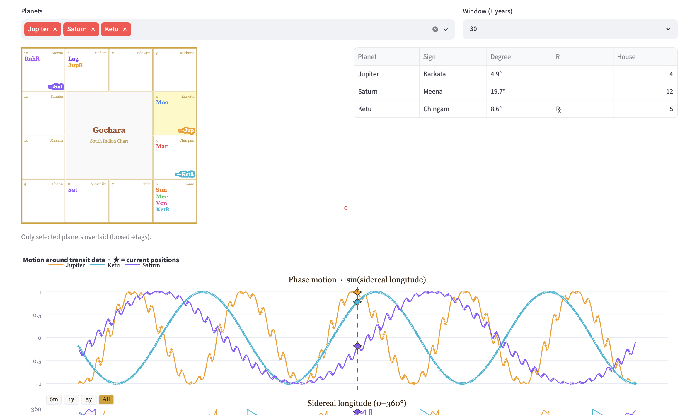

# Planet in Motion

A astrology web app built with Streamlit. Enter a birth city and date to get a full sidereal birth chart, Vimshottari dasa timeline with Lagna-specific quality ratings, live transit (gochara) overlay, a dasa–transit confluence panel, a forward scanner for finding optimal timing windows, interactive planetary motion curves, and a personalised house guide with visualisations.



Positions are computed with the [Swiss Ephemeris](https://www.astro.com/swisseph/) using the **Lahiri (Chitra-Paksha) ayanamsa** — the standard for Indian predictive astrology.

---

## Features

| Tab / Section | What it shows |
|---------------|---------------|
| 📜 Birth Chart | South-Indian SVG chart · nakshatra/pada · dignity · house placements |
| 🌍 Current Transit | Gochara overlay on natal chart · Sade-Sati & Jupiter-Moon detection |
| 🔭 Transit + Motion | Combined gochara snapshot + motion window with star-pinned positions |
| 🏠 House Guide — What's active | Planet → sign → your house → life area for the selected transit date |
| 🏠 House Guide — **Dasa–Transit Confluence** | Active dasa/bhukti lord + its functional quality for your Lagna + the house it is currently transiting, in one place |
| 🏠 House Guide — **Forward Scanner** | Pick a goal (career, marriage, wealth…) → find the next dates when slow planets (Jupiter, Saturn, Rahu, Ketu) enter the relevant houses, with estimated duration |
| 🏠 House Guide — House map & lordships | 12-house theme map · planet rulerships relative to your Lagna · notable Lagna-specific bullets |
| 🏠 House Guide — Activation chart | Weighted bar chart of current house activation by transiting planets |
| 🏠 House Guide — Planet journeys | Step chart showing which house each planet occupies over time |
| 🏠 House Guide — Phase wave | Sin-wave of one planet's longitude with colored house bands |
| 📋 Extra Info — **Dasa Timeline** | Full Maha-dasa list with **quality color-coding per Lagna** (Yogakaraka / Lagna Lord / Benefic / Mixed / Malefic / Neutral / Shadowy) + Bhukti breakdown |
| 📋 Extra Info — Planet Positions | Nirayana longitudes, nakshatra, pada, house, dignity, retrograde |
| 📋 Extra Info — Planet Motion | Phase + longitude charts · retrograde diamonds · pairwise interaction · closest-pass table |

---

## Timing interpretation guide

### Dasa quality labels

Every dasa lord is rated for your specific Lagna based on which houses it rules:

| Label | Meaning |
|-------|---------|
| **Yogakaraka** | Rules a trine (H5 or H9) AND a kendra (H1/4/7/10) — most powerful |
| **Lagna Lord** | Rules the 1st house — always auspicious; shapes the whole chart |
| **Benefic** | Rules a trine (H5 or H9) without dusthana — growth-oriented |
| **Mixed** | Owns both a positive and a dusthana house — dual themes |
| **Neutral** | Neither trikona nor dusthana — moderate, natural results |
| **Malefic** | Rules only dusthana (H6/8/12) — karmic pressure, delays |
| **Shadowy** | Rahu / Ketu — adopt the lord of the sign they occupy |

### Dasa–Transit Confluence

The **House Guide → Dasa–Transit Confluence** section connects two signals that are normally read separately:

1. Which dasa and bhukti are active (and whether that lord is auspicious for your Lagna)
2. Which house that same lord is currently transiting

When both point to the same goal-house, the period is strongly activated. Example: if you are in a Jupiter dasa (Yogakaraka for your Lagna) and Jupiter is transiting your 10th house, career matters are doubly emphasised.

### Forward Scanner

The **House Guide → Forward Scanner** helps answer "when is the next good window?" for a goal:

1. Select a goal from the preset list (Career, Marriage, Wealth, etc.)
2. The app maps the goal to its relevant houses
3. It scans forward at 7-day steps and returns the next dates when Jupiter, Saturn, Rahu, or Ketu enter those houses, with estimated durations

Fast planets complete all 12 houses in under a year and are excluded — they matter for day-to-day timing, not multi-year windows.

---

## Setup

### Recommended — uv (fast, reproducible)

```bash
# install uv once: https://docs.astral.sh/uv/getting-started/installation/
uv sync                              # creates .venv and installs all dependencies
source .venv/bin/activate
streamlit run planet_in_motion/app.py
```

### Alternative — plain pip

```bash
python3 -m venv .venv
source .venv/bin/activate
pip install -r planet_in_motion/requirements.txt
streamlit run planet_in_motion/app.py
```

> **Note:** `uv.lock` pins every transitive dependency for exact reproducibility. `pyproject.toml` declares the direct runtime dependencies.

---

## Project structure

```
planet-patterns-astrology/
├── pyproject.toml              # project metadata + direct dependencies
├── uv.lock                     # full dependency lock (generated by uv lock)
└── planet_in_motion/
    ├── app.py                  # Streamlit UI — 5 tabs, sidebar, session state
    ├── astro_core.py           # Chart engine — Swiss Ephemeris wrappers, dasa, house logic, functional nature
    ├── chart_render.py         # SVG chart renderer (South-Indian fixed-sign grid)
    ├── motion_viz.py           # Plotly figure builders (motion, interaction, house charts)
    ├── config.toml             # personal birth details (gitignored)
    ├── config.example.toml     # safe template (tracked in git)
    └── requirements.txt        # legacy pip requirements (kept for compatibility)
```

---

## Architecture & data flow

### 1. Location → coordinates (`app.py › geocode_city`)

```
User types a city name in the sidebar
    → geocode_city(city)                          # app.py
        → GET nominatim.openstreetmap.org/search  # returns lat, lon
        → GET timeapi.io/api/timezone/coordinate  # returns UTC offset in seconds
        → fallback: tz ≈ round(lon / 15 × 2) / 2 if API unreachable
    → st.session_state.{lat_input, lon_input, tz_input} updated
```

### 2. Chart calculation (`astro_core.py › build_chart`)

```
build_chart(dt_local, tz_offset, lat, lon)
    → local_to_jd()          converts local datetime → Julian Day (UTC)
    → swe.set_sid_mode(SIDM_LAHIRI)
    → swe.calc_ut(jd, planet_id, FLG_SIDEREAL|FLG_SPEED)
                             for each of Sun/Moon/Mercury/Venus/Mars/Jupiter/Saturn/Rahu
    → Ketu = (Rahu longitude + 180°) % 360
    → swe.houses_ex(jd, lat, lon, "P", FLG_SIDEREAL)
                             → Ascendant (sidereal longitude)
    → returns Chart(ascendant, asc_rasi_index, planets{name→PlanetPos}, ayanamsa)
```

`PlanetPos` carries: `longitude` (0–360° sidereal), `rasi_index`, `deg_in_rasi`, `nakshatra`, `pada`, `retro`.

### 3. Birth chart SVG (`chart_render.py › render_chart_svg`)

```
render_chart_svg(chart, title, highlight, transit)
    → fixed 4×4 South-Indian grid; sign position is fixed, not house-relative
    → GRID_POS maps rasi_index → (row, col) in the grid
    → chart.planets_in_rasi(idx) fetches natal planets for each cell
    → transit dict overlays transiting planets with boxed arrow tags
    → returns inline SVG string rendered via st.markdown(..., unsafe_allow_html=True)
```

### 4. Dasa timeline (`astro_core.py`)

```
vimshottari_periods(moon_longitude, birth_dt)
    → nakshatra of Moon → starting lord → balance of first dasa from nakshatra fraction
    → walks the 9-lord DASA_SEQUENCE for the full 120-year cycle

sub_periods(maha_lord, maha_start, maha_years)
    → proportional Antardasa breakdown within a Maha-dasa

current_dasa(periods, on_date)
    → finds the active Maha-dasa and Antardasa for a given date
```

### 5. Dasa quality (`astro_core.py › functional_nature`)

```
functional_nature(planet, asc_rasi_index)
    → derives the houses a planet rules via OWN dict + house_from_lagna()
    → classifies into Yogakaraka / Lagna Lord / Benefic / Mixed / Malefic / Neutral / Shadowy
    → returns {label, color, explanation}
    → used in app.py for dasa table row coloring and the confluence panel
```

Classification logic:
- **Yogakaraka**: owns a pure trikona (H5 or H9) AND a kendra (H1/4/7/10)
- **Lagna Lord**: owns H1 regardless of second sign
- **Benefic**: owns H5 or H9 without dusthana
- **Mixed**: trikona+dusthana or kendra+dusthana
- **Malefic**: only dusthana (H6/8/12) with no kendra or trikona
- **Neutral**: upachaya only (H3/11) or other non-trikona/non-dusthana

### 6. Dasa–Transit Confluence (`app.py › tab_house`)

```
For each active lord (Maha + Antardasa):
    → functional_nature(lord, asc_rasi_index)  → quality label + color
    → tchart.planets[lord].rasi_index          → which sign the lord transits today
    → chart.house_of(transit_rasi_index)       → which of YOUR houses that is
    → rendered as colored badge + house label in one line
```

### 7. Forward Scanner (`app.py › find_house_entries`)

```
find_house_entries(df, asc_rasi_index, target_houses)
    → processes a pre-cached timeseries dataframe (7-day steps)
    → detects house transitions: longitude // 30 maps to rasi → house_of() → house number
    → records entry date + estimates duration until next house change
    → returns rows sorted by entry date
```

The timeseries is computed via `cached_timeseries` (Streamlit cache) to avoid re-running Swiss Ephemeris calls on every widget interaction.

### 8. Planet motion timeseries (`astro_core.py › planetary_timeseries`)

```
planetary_timeseries(start, end, tz, lat, lon, planet_names, step_days)
    → loops over date range in step_days increments
    → calls build_chart() at each step
    → collects {when_local, planet, longitude, rasi, retro, phase_sin, phase_cos}
    → phase_sin = sin(sidereal longitude) — the smooth oscillating wave
    → cached in app.py via @st.cache_data
```

### 9. Motion figures (`motion_viz.py`)

| Function | Chart | Key idea |
|----------|-------|----------|
| `build_motion_figure` | Two stacked subplots: sin-wave (top) + raw longitude 0–360° (bottom) | Diamonds mark retrograde samples; star pins current transit |
| `build_interaction_figure` | Pairwise angular separation over time | Gold band = conjunction ≤12°, orange = opposition ≥168° |
| `closest_passes` | Table of closest-approach dates per planet pair | `nsmallest` on angular separation series |

### 10. House guide visualisations (`motion_viz.py`)

| Function | Chart | How it works |
|----------|-------|--------------|
| `build_house_activation_figure` | Horizontal bar per house | Weight = Σ `PLANET_SIGNIFICANCE` of transiting planets |
| `build_house_journey_figure` | Step chart Y = house 1–12 over time | `house = ((longitude // 30) - asc_rasi_index) % 12 + 1`; line shape = `"hv"` |
| `build_sinwave_house_figure` | Sin-wave with colored vertical bands | Bands are `add_vrect` segments keyed on house transitions; each labeled H1–H12 |

---

## Key constants (`astro_core.py`)

| Constant | Purpose |
|----------|---------|
| `RASIS` | Malayalam rasi names (Medam … Meena) |
| `RASIS_EN` | Western equivalents (Aries … Pisces) |
| `NAKSHATRAS` | 27 nakshatra names |
| `DASA_SEQUENCE` | 9-lord Vimshottari order with year lengths |
| `EXALT / DEBIL / OWN` | Dignity lookup tables by rasi index |
| `HOUSE_KEYWORDS / HOUSE_SIGNIFICATIONS` | Short and long descriptions for H1–H12 |
| `PLANETS` | `{name: swisseph_id}` for the 8 computed bodies |
| `PLANET_KARAKA` | Natural significator description per planet |
| `GOAL_HOUSES` | Goal label → list of relevant house numbers for the forward scanner |

---

## Ephemeris note

Swiss Ephemeris stores data in binary files. `pyswisseph` bundles the essential files; for dates before 1800 CE or after 2400 CE you may need to download the full `ephe/` directory from [astro.com](https://www.astro.com/swisseph/ephe/).
